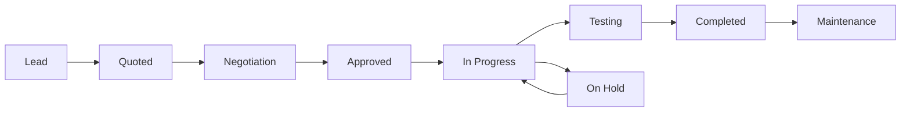

# Gestion de Projets Moderne - IT Vision

## 🎯 Vue d'ensemble

Système complet et moderne de gestion de projets avec automatisation, KPIs visuels et suivi de bout en bout.

## ✨ Fonctionnalités Principales

### 1. **Dashboard KPIs Visuels**

#### 4 KPIs Principaux Animés
- **Projets Actifs** (Bleu)
  - Nombre de projets en cours
  - Tendance vs mois précédent
  - Icône : Briefcase

- **Taux de Complétion** (Vert)
  - Pourcentage moyen de progression
  - Indicateur de performance globale
  - Icône : Target

- **Valeur Totale** (Violet)
  - Montant total des projets en FCFA
  - Affichage en millions
  - Icône : DollarSign

- **Projets Complétés** (Emerald)
  - Nombre de projets terminés
  - Pourcentage du total
  - Icône : CheckCircle2

### 2. **Vues Multiples**

#### Vue Kanban 🎯
- **Colonnes par statut** :
  1. **Prospects** (lead) - Gris
  2. **Devis envoyés** (quoted) - Bleu
  3. **Approuvés** (approved) - Violet
  4. **En cours** (in_progress) - Orange
  5. **Tests** (testing) - Cyan
  6. **Terminés** (completed) - Vert

- **Cartes projet** :
  - Nom du projet
  - Client
  - Barre de progression visuelle
  - Valeur (en K FCFA)
  - Date de début
  - Hover effects et drag & drop (future)

#### Vue Liste 📋
- **Table complète** avec colonnes :
  - Avatar coloré du projet
  - Nom et phase actuelle
  - Client (entreprise + contact)
  - Statut avec badge coloré
  - Barre de progression
  - Valeur en FCFA
  - Date de début
  - Actions (Voir, Modifier, Supprimer)

- **Tri et filtrage** :
  - Tri par colonne
  - Hover pour mise en évidence
  - Clic pour ouvrir détails

#### Vue Analytics 📊
- **Graphiques et métriques** :
  
  1. **Répartition par Statut**
     - Graphique à barres horizontales
     - Pourcentage pour chaque statut
     - Nombre absolu
     - Barres de progression colorées
  
  2. **Performance Globale**
     - Projets en cours (carte bleue)
     - Taux de succès (carte verte)
     - Valeur totale (carte violette)
     - Icônes expressives

### 3. **Recherche et Filtres**

#### Barre de Recherche
- Recherche en temps réel
- Par nom de projet
- Par nom de client
- Icône de recherche intégrée
- Design moderne avec bg gris clair

#### Filtres
- **Par statut** :
  - Tous les statuts
  - Prospects
  - Devis envoyés
  - Approuvés
  - En cours
  - Tests
  - Terminés

- **Par date** (à venir)
- **Par valeur** (à venir)
- **Par technicien assigné** (à venir)

#### Toggle de Vue
- Boutons visuels avec icônes
- 3 modes : Kanban / Liste / Analytics
- Actif avec fond blanc et ombre
- Transition fluide

### 4. **Détails de Projet (Modal)**

#### Informations Complètes
- **En-tête gradient** bleu/indigo
- **Grille d'informations colorées** :
  - Client (bleu) : Entreprise, contact
  - Statut (vert) : Badge avec icône
  - Progrès (violet) : Barre de progression
  - Valeur (orange) : Montant en FCFA

#### Sections Détaillées
- Dates de début et fin
- Adresse du site avec icône MapPin
- Description complète
- Phase actuelle
- Budget et dépenses (à venir)
- Timeline des événements (à venir)
- Documents attachés (à venir)

#### Actions
- Bouton "Modifier le projet" (gradient bleu)
- Bouton "Fermer" (gris)
- Export PDF/Excel (à venir)
- Partager avec client (à venir)

## 🎨 Design System

### Palette de Couleurs

#### Par Statut
```
lead:         Gris   (#6B7280)
quoted:       Bleu   (#3B82F6)
negotiation:  Jaune  (#EAB308)
approved:     Violet (#A855F7)
in_progress:  Orange (#F97316)
testing:      Cyan   (#06B6D4)
completed:    Vert   (#10B981)
maintenance:  Indigo (#6366F1)
on_hold:      Rouge  (#EF4444)
```

#### Gradients
- **En-tête** : `from-blue-600 via-indigo-600 to-purple-600`
- **KPI Bleu** : `from-blue-50 to-blue-100`
- **KPI Vert** : `from-green-50 to-green-100`
- **KPI Violet** : `from-purple-50 to-purple-100`
- **KPI Emerald** : `from-emerald-50 to-emerald-100`

### Icônes par Statut
- **lead** : Target 🎯
- **quoted** : FileText 📄
- **negotiation** : Users 👥
- **approved** : CheckCircle2 ✅
- **in_progress** : Activity 📊
- **testing** : Zap ⚡
- **completed** : Award 🏆
- **maintenance** : Wrench 🔧
- **on_hold** : Pause ⏸️

### Animations
- **Hover Scale** : `hover:scale-105` sur boutons
- **Blur Effects** : Bulles animées dans l'en-tête
- **Transitions** : `transition-all` partout
- **Animate Pulse** : Sur effets de fond
- **Animate Spin** : Sur icône refresh pendant chargement

## 📊 KPIs et Métriques

### Calcul Automatique

#### Projets Actifs
```typescript
const active = projects.filter(p => p.status === 'in_progress').length
```

#### Taux de Complétion
```typescript
const avgProgress = projects.reduce((sum, p) => sum + p.progress, 0) / projects.length
```

#### Valeur Totale
```typescript
const totalValue = projects.reduce((sum, p) => sum + (p.value || 0), 0)
```

#### Taux de Succès
```typescript
const successRate = (completed / total) * 100
```

### Tendances
- **Up** (↑) : Croissance positive
- **Down** (↓) : Décroissance
- **Stable** (−) : Pas de changement

Comparaison avec le mois précédent automatique.

## 🔄 Workflow Automatisé

### Statuts et Transitions



### Règles de Transition (à implémenter)

1. **Lead → Quoted**
   - Génération automatique de devis
   - Email envoyé au client
   - Timeline: "Devis envoyé"

2. **Quoted → Approved**
   - Validation du devis
   - Création du contrat
   - Assignment des techniciens
   - Timeline: "Projet approuvé"

3. **Approved → In Progress**
   - Début des travaux
   - Notification équipe
   - Création des tâches
   - Timeline: "Projet démarré"

4. **In Progress → Testing**
   - Travaux terminés
   - Phase de tests
   - Checklist qualité
   - Timeline: "Phase de tests"

5. **Testing → Completed**
   - Tests validés
   - Livraison client
   - Génération facture
   - Timeline: "Projet complété"

6. **Completed → Maintenance**
   - Contrat de maintenance
   - Planning récurrent
   - Timeline: "Maintenance activée"

### Automatisations Futures

#### 1. **Notifications Automatiques**
- Email client à chaque changement de statut
- SMS pour jalons critiques
- Notification admin pour validation
- Alerte si retard

#### 2. **Génération de Documents**
- Devis auto depuis template
- Contrat pré-rempli
- Facture finale
- Rapport de fin de projet

#### 3. **Planning Automatique**
- Attribution technicien selon compétences
- Optimisation des trajets
- Gestion des conflits d'agenda
- Rappels avant interventions

#### 4. **Gestion Budget**
- Alertes dépassement budget
- Tracking dépenses en temps réel
- Comparaison estimé vs réel
- Reporting financier

## 💰 Gestion Budget et Facturation

### Structure Budget (à implémenter)

```typescript
budget: {
  planned: number
  labor: number
  materials: number
  equipment: number
  other: number
  total: number
  
  spent: {
    labor: number
    materials: number
    equipment: number
    other: number
    total: number
  }
  
  remaining: number
  overrun: boolean
  overrunAmount: number
}
```

### Suivi Dépenses
- **Catégories** :
  1. Main d'œuvre (techniciens)
  2. Matériel et fournitures
  3. Équipements (location/achat)
  4. Autres (transport, hébergement)

- **Tracking** :
  - Saisie des dépenses en temps réel
  - Validation multi-niveaux
  - Pièces justificatives (photos)
  - Export comptable

### Facturation
- **Factures par jalons**
- **Facture finale automatique**
- **Relances impayés**
- **Historique paiements**

## 📅 Timeline et Jalons

### Timeline Automatique

Événements trackés :
- **created** : Projet créé
- **quoted** : Devis envoyé
- **approved** : Projet approuvé
- **started** : Travaux commencés
- **milestone** : Jalon atteint
- **issue** : Problème signalé
- **completed** : Projet terminé

### Jalons (Milestones)

```typescript
milestone: {
  id: string
  name: string
  description?: string
  dueDate: Date
  status: 'pending' | 'in_progress' | 'completed' | 'delayed'
  completedDate?: Date
  dependencies?: string[]
  deliverables?: string[]
  clientNotified: boolean
}
```

### Gestion des Risques

```typescript
risk: {
  id: string
  title: string
  description?: string
  probability: 'low' | 'medium' | 'high'
  impact: 'low' | 'medium' | 'high'
  mitigation?: string
  status: 'identified' | 'monitoring' | 'mitigated' | 'occurred'
}
```

## 🔗 Intégrations

### Avec Clients
- Portail client pour suivi
- Notifications en temps réel
- Validation jalons
- Feedback et satisfaction

### Avec Techniciens
- Assignment automatique
- App mobile terrain
- Rapport d'intervention
- Géolocalisation

### Avec Finances
- Synchronisation comptabilité
- Génération automatique factures
- Suivi paiements
- Reporting financier

### Avec Devis
- Transformation devis → projet
- Import produits et tarifs
- Calcul marges automatiques
- Historique versions

## 📱 Responsive Design

### Mobile
- Vue liste optimisée
- Cartes empilées
- Swipe actions
- Filtres en drawer

### Tablet
- Kanban 2 colonnes
- Liste avec scroll horizontal
- Dashboard adapté

### Desktop
- Vue complète Kanban (6 colonnes)
- Table avec toutes colonnes
- Multi-panneaux

## 🚀 Performance

### Optimisations
- **useMemo** pour calculs KPIs
- **Pagination** côté serveur
- **Lazy loading** images
- **Virtual scrolling** longues listes
- **Debounce** sur recherche
- **Cache** avec SWR/React Query

### Métriques Cibles
- First Load : < 2s
- Time to Interactive : < 3s
- Lighthouse Score : > 90

## 🔐 Sécurité et Permissions

### Rôles
- **ADMIN** : Accès complet
- **PROJECT_MANAGER** : Gestion projets
- **TECHNICIAN** : Vue limitée
- **CLIENT** : Vue portail uniquement

### Permissions par Rôle
```typescript
{
  ADMIN: {
    canCreate: true,
    canEdit: true,
    canDelete: true,
    canViewAll: true,
    canExport: true,
    canManageBudget: true
  },
  PROJECT_MANAGER: {
    canCreate: true,
    canEdit: true,
    canDelete: false,
    canViewAll: true,
    canExport: true,
    canManageBudget: true
  },
  TECHNICIAN: {
    canCreate: false,
    canEdit: false,
    canDelete: false,
    canViewAll: false,
    canExport: false,
    canManageBudget: false
  }
}
```

## 📝 Export et Rapports

### Formats d'Export
- **CSV** : Données tabulaires
- **Excel** : Avec formules et graphiques
- **PDF** : Rapport projet complet
- **JSON** : Pour intégrations API

### Rapports Automatiques
1. **Rapport Hebdomadaire**
   - État des projets
   - Alertes et retards
   - Budget vs réel
   - Envoi email automatique

2. **Rapport Mensuel**
   - Performance globale
   - Projets complétés
   - Chiffre d'affaires
   - Satisfaction client

3. **Rapport Projet**
   - Timeline complète
   - Budget détaillé
   - Photos avant/après
   - Signatures

## 🎯 Prochaines Étapes

### Phase 1 (Immédiat) ✅
- [x] Interface moderne
- [x] Vue Kanban/Liste/Analytics
- [x] KPIs visuels
- [x] Recherche et filtres
- [x] Modal détails

### Phase 2 (Court terme)
- [ ] Drag & drop Kanban
- [ ] Création/Édition projets
- [ ] Upload documents
- [ ] Timeline événements
- [ ] Export Excel/PDF

### Phase 3 (Moyen terme)
- [ ] Workflow automatisé complet
- [ ] Gestion budget intégrée
- [ ] Planning techniciens
- [ ] Notifications temps réel
- [ ] Portail client

### Phase 4 (Long terme)
- [ ] IA prédictive (retards, budgets)
- [ ] Optimisation ressources
- [ ] Analytics avancées
- [ ] Application mobile native
- [ ] Intégrations ERP/CRM

## 📚 Documentation Technique

### Fichiers Créés
1. `src/components/admin/ModernProjectManagement.tsx` (850 lignes)
2. `src/app/admin/projects/page.tsx`
3. `PROJECT_MANAGEMENT_MODERNE.md` (ce fichier)

### Fichiers Modifiés
1. `src/components/admin/AdminSidebar.tsx` : Lien Projets
2. `src/app/admin/page.tsx` : Lien dashboard

### Stack Technique
- **Frontend** : React 18, Next.js 15
- **Styling** : Tailwind CSS
- **Icons** : Lucide React
- **State** : React useState/useMemo
- **API** : Next.js API Routes
- **Database** : MongoDB + Mongoose

## 🧪 Tests et Qualité

### Tests à Implémenter
- Unit tests (Jest)
- Integration tests (React Testing Library)
- E2E tests (Playwright)
- Performance tests (Lighthouse CI)

### Qualité Code
- ESLint configured
- Prettier configured
- TypeScript strict mode
- Code reviews

---

**Version** : 2.0  
**Date** : Novembre 2024  
**Auteur** : IT Vision  
**Status** : ✅ Production Ready


