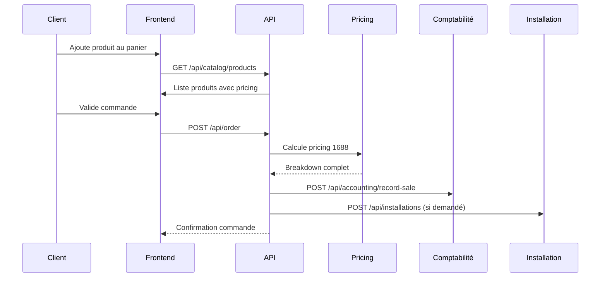
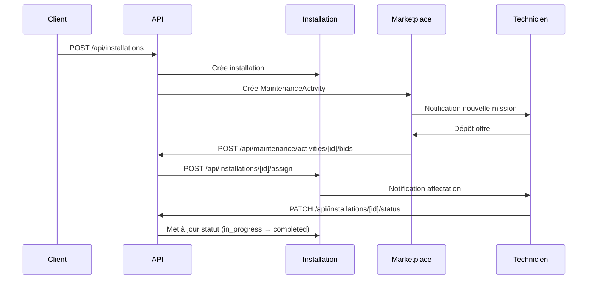
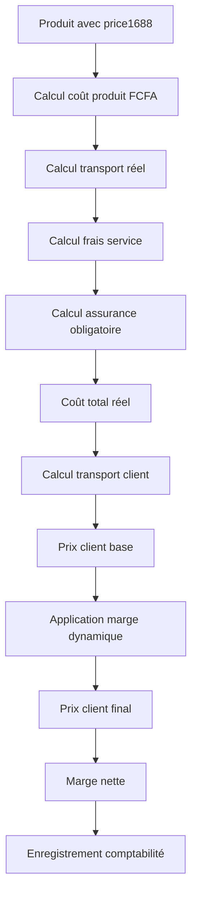

# Architecture Produits - Documentation Complète

## 📋 Table des matières

1. [Vue d'ensemble](#vue-densemble)
2. [Workflows](#workflows)
3. [Calcul Pricing 1688](#calcul-pricing-1688)
4. [Schémas JSON](#schémas-json)
5. [APIs](#apis)
6. [Modules](#modules)

---

## Vue d'ensemble

### Architecture générale

```
┌─────────────────────────────────────────────────────────────┐
│                    FRONTEND (Next.js 14)                    │
├─────────────────────────────────────────────────────────────┤
│  ProductCard  │  ProductDetail  │  AdminProductManager      │
└─────────────────────────────────────────────────────────────┘
                            │
                            ▼
┌─────────────────────────────────────────────────────────────┐
│                    API LAYER                                │
├─────────────────────────────────────────────────────────────┤
│  /api/products      │  /api/catalog/products                │
│  /api/pricing/simulate  │  /api/installations               │
└─────────────────────────────────────────────────────────────┘
                            │
                            ▼
┌─────────────────────────────────────────────────────────────┐
│                    BUSINESS LOGIC                           │
├─────────────────────────────────────────────────────────────┤
│  pricing1688.ts  │  logistics.ts  │  catalog-format.ts     │
└─────────────────────────────────────────────────────────────┘
                            │
                            ▼
┌─────────────────────────────────────────────────────────────┐
│                    DATA LAYER (MongoDB)                      │
├─────────────────────────────────────────────────────────────┤
│  Product  │  Installation  │  AccountingEntry              │
└─────────────────────────────────────────────────────────────┘
```

### Types TypeScript

Tous les types sont centralisés dans `src/lib/types/product.types.ts` :

- `ProductResponse` : Produit complet pour API
- `ProductSummary` : Produit simplifié pour liste
- `Pricing1688Data` : Données pricing 1688
- `Pricing1688Breakdown` : Détail complet des calculs
- `ProductLogistics` : Dimensions, poids, volume
- `ProductAvailability` : Statut stock, délais

---

## Workflows

### 1. Workflow Achat Produit



### 2. Workflow Installation Technicien



### 3. Workflow Pricing 1688



---

## Calcul Pricing 1688

### Formule complète

```
1. Coût produit FCFA = price1688 × exchangeRate
   OU baseCost (si fourni directement)

2. Transport réel = f(méthode, poids/volume, overrides)
   - Express: 11 000 CFA/kg (réel) vs 12 000 CFA/kg (client)
   - Aérien: 7 500 CFA/kg (réel) vs 8 000 CFA/kg (client)
   - Maritime: 135 000 CFA/m³ (réel) vs 145 000 CFA/m³ (client)

3. Frais service = productCostFCFA × (serviceFeeRate / 100)
   - Taux: 5%, 10%, ou 15%

4. Assurance = (productCostFCFA + shippingCostReal) × (insuranceRate / 100)
   - Par défaut: 2.5% obligatoire si non spécifié

5. Coût total réel = productCostFCFA + shippingCostReal + serviceFee + insuranceFee

6. Prix transport client = f(méthode, poids/volume, overrides)
   - Utilise BASE_SHIPPING_RATES (prix déclarés)

7. Prix client base = productCostFCFA + shippingCostClient

8. Marge dynamique = baseMargin × multiplier(quantité)
   - 1-5 unités: ×1.0 (marge standard)
   - 6-20 unités: ×0.95 (-5%)
   - 21-50 unités: ×0.90 (-10%)
   - 51+ unités: ×0.85 (-15%)

9. Prix client final = totalRealCost + dynamicMargin

10. Marge nette = totalClientPrice - totalRealCost
    Marge % = (netMargin / totalRealCost) × 100
```

### Exemple de calcul

**Produit** :
- Prix 1688: 100 ¥
- Taux change: 100 (1¥ = 100 FCFA)
- Frais service: 10%
- Assurance: 2.5% (obligatoire)
- Transport: Express, 2 kg
- Quantité: 10 unités

**Calcul** :
```
1. Coût produit = 100 × 100 = 10 000 FCFA
2. Transport réel = 2 × 11 000 = 22 000 FCFA
3. Frais service = 10 000 × 0.10 = 1 000 FCFA
4. Assurance = (10 000 + 22 000) × 0.025 = 800 FCFA
5. Coût total réel = 10 000 + 22 000 + 1 000 + 800 = 33 800 FCFA
6. Transport client = 2 × 12 000 = 24 000 FCFA
7. Prix client base = 10 000 + 24 000 = 34 000 FCFA
8. Marge base = 34 000 - 33 800 = 200 FCFA
9. Marge dynamique (10 unités = tier medium) = 200 × 0.95 = 190 FCFA
10. Prix client final = 33 800 + 190 = 33 990 FCFA
11. Marge nette = 33 990 - 33 800 = 190 FCFA
12. Marge % = (190 / 33 800) × 100 = 0.56%
```

---

## Schémas JSON

### ProductResponse (API Catalogue)

```json
{
  "id": "507f1f77bcf86cd799439011",
  "name": "Caméra IP 4K",
  "tagline": "Surveillance haute définition",
  "description": "Caméra IP avec vision nocturne...",
  "category": "CCTV",
  "image": "https://example.com/image.jpg",
  "gallery": ["https://example.com/img1.jpg", "https://example.com/img2.jpg"],
  "features": ["4K", "Vision nocturne", "Détection mouvement"],
  "colorOptions": ["Noir", "Blanc"],
  "variantOptions": ["2MP", "4MP", "8MP"],
  "requiresQuote": false,
  "pricing": {
    "currency": "FCFA",
    "salePrice": 125000,
    "requiresQuote": false,
    "availabilityLabel": "En stock",
    "availabilitySubLabel": "Livraison sous 3 jours",
    "shippingOptions": [
      {
        "id": "air_express",
        "label": "Express aérien 3 jours",
        "description": "Livraison express porte-à-porte",
        "durationDays": 3,
        "cost": 24000,
        "currency": "FCFA",
        "total": 149000
      }
    ]
  },
  "pricing1688": {
    "price1688": 100,
    "price1688Currency": "CNY",
    "exchangeRate": 100,
    "serviceFeeRate": 10,
    "insuranceRate": 2.5,
    "breakdown": {
      "productCostFCFA": 10000,
      "shippingCostReal": 22000,
      "serviceFee": 1000,
      "insuranceFee": 800,
      "totalRealCost": 33800,
      "shippingCostClient": 24000,
      "totalClientPrice": 33990,
      "shippingMargin": 2000,
      "netMargin": 190,
      "marginPercentage": 0.56,
      "currency": "FCFA",
      "shippingMethodLabel": "Express aérien 3 jours",
      "shippingMethodDuration": 3
    }
  },
  "availability": {
    "status": "in_stock",
    "label": "En stock",
    "note": null,
    "stockQuantity": 15,
    "leadTimeDays": 3
  },
  "logistics": {
    "weightKg": 2.5,
    "packagingWeightKg": 0.3,
    "volumeM3": 0.02,
    "dimensions": {
      "lengthCm": 20,
      "widthCm": 15,
      "heightCm": 10
    }
  },
  "sourcing": {
    "platform": "1688",
    "supplierName": "Fournisseur Chine",
    "supplierContact": "contact@example.com",
    "productUrl": "https://1688.com/product/123",
    "notes": null
  },
  "createdAt": "2024-01-15T10:00:00Z",
  "updatedAt": "2024-01-20T14:30:00Z",
  "isFeatured": true,
  "rating": 4.7
}
```

### Installation (API)

```json
{
  "id": "507f1f77bcf86cd799439012",
  "productId": "507f1f77bcf86cd799439011",
  "productName": "Caméra IP 4K",
  "orderId": "CMD-2024-001",
  "clientId": "507f1f77bcf86cd799439013",
  "clientName": "Jean Dupont",
  "clientContact": {
    "name": "Jean Dupont",
    "email": "jean@example.com",
    "phone": "+221771234567",
    "address": "123 Rue Example, Dakar"
  },
  "installationOptions": {
    "includeMaterials": true,
    "preferredDate": "2024-02-01T10:00:00Z",
    "notes": "Installation en hauteur, prévoir échelle",
    "quantity": 2
  },
  "status": "assigned",
  "assignedTechnicianId": "507f1f77bcf86cd799439014",
  "assignedTechnicianName": "Amadou Diallo",
  "assignedAt": "2024-01-25T09:00:00Z",
  "autoAssigned": true,
  "allowMarketplace": true,
  "bidsCount": 3,
  "bestBidAmount": 25000,
  "scheduledDate": "2024-02-01T10:00:00Z",
  "completedDate": null,
  "createdAt": "2024-01-20T14:00:00Z",
  "updatedAt": "2024-01-25T09:00:00Z"
}
```

### Pricing1688Input (Simulateur)

```json
{
  "productId": "507f1f77bcf86cd799439011",
  "price1688": 100,
  "exchangeRate": 100,
  "shippingMethod": "air_express",
  "weightKg": 2.5,
  "volumeM3": 0.02,
  "serviceFeeRate": 10,
  "insuranceRate": 2.5,
  "orderQuantity": 10,
  "monthlyVolume": 50
}
```

---

## APIs

### GET /api/catalog/products

**Description** : Liste des produits pour le catalogue client

**Query params** :
- `page` : Numéro de page (défaut: 1)
- `limit` : Nombre par page (défaut: 24)
- `category` : Filtre par catégorie
- `search` : Recherche textuelle

**Response** :
```json
{
  "success": true,
  "products": [ProductResponse],
  "pagination": {
    "page": 1,
    "limit": 24,
    "total": 150,
    "totalPages": 7,
    "hasMore": true
  }
}
```

### POST /api/pricing/simulate

**Description** : Simule le pricing 1688 complet

**Body** : `Pricing1688Input`

**Response** :
```json
{
  "success": true,
  "simulation": {
    "breakdown": Pricing1688Breakdown,
    "currency": "FCFA",
    "shippingMethod": {
      "id": "air_express",
      "label": "Express aérien 3 jours",
      "durationDays": 3
    }
  }
}
```

### POST /api/installations

**Description** : Crée une installation depuis un achat

**Body** :
```json
{
  "productId": "string",
  "productName": "string",
  "orderId": "string",
  "clientName": "string",
  "clientEmail": "string",
  "clientPhone": "string",
  "address": "string",
  "includeMaterials": boolean,
  "preferredDate": "ISO date",
  "notes": "string",
  "quantity": number
}
```

### POST /api/installations/[id]/assign

**Description** : Affecte un technicien (auto ou manuel)

**Body** :
```json
{
  "technicianId": "string (optionnel)",
  "autoAssign": boolean
}
```

### PATCH /api/installations/[id]/status

**Description** : Met à jour le statut

**Body** :
```json
{
  "status": "pending" | "assigned" | "in_progress" | "completed" | "cancelled",
  "notes": "string (optionnel)"
}
```

---

## Modules

### 1. `src/lib/pricing1688.refactored.ts`

Module unique pour tous les calculs pricing 1688.

**Fonctions principales** :
- `simulatePricing1688()` : Calcul complet
- `simulatePricingFromProduct()` : Depuis un produit existant
- `getDynamicMarginMultiplier()` : Multiplicateur selon volume
- `formatPricingBreakdown()` : Formatage pour affichage

**Constantes** :
- `DEFAULT_EXCHANGE_RATE = 100`
- `DEFAULT_MANDATORY_INSURANCE_RATE = 2.5%`
- `DYNAMIC_MARGIN_TIERS` : Seuils de marge dynamique

### 2. `src/lib/types/product.types.ts`

Types TypeScript stricts centralisés.

**Types principaux** :
- `ProductResponse` : Produit complet API
- `ProductSummary` : Produit liste
- `Pricing1688Input` : Input simulateur
- `Pricing1688Breakdown` : Résultat calcul
- `ProductLogistics` : Logistique
- `ProductAvailability` : Disponibilité

### 3. `src/lib/models/Product.validated.ts`

Modèle Mongoose avec validations strictes.

**Validations** :
- Nom : 2-200 caractères
- Prix : positif ou nul
- Dimensions : toutes requises si une présente
- Volume : calculé automatiquement
- Service fee : 5, 10, ou 15 uniquement
- Stock status : enum strict

### 4. `src/lib/models/Installation.ts`

Modèle Installation techniciens.

**Statuts** :
- `pending` : En attente
- `assigned` : Affecté
- `in_progress` : En cours
- `completed` : Terminé
- `cancelled` : Annulé

**Transitions valides** :
- `pending` → `assigned` | `cancelled`
- `assigned` → `in_progress` | `cancelled`
- `in_progress` → `completed` | `cancelled`

---

## Bonnes pratiques

### 1. Utilisation des types

Toujours utiliser les types depuis `product.types.ts` :

```typescript
import type { ProductResponse, Pricing1688Input } from '@/lib/types/product.types'
```

### 2. Calculs pricing

Utiliser le module refactoré :

```typescript
import { simulatePricing1688 } from '@/lib/pricing1688.refactored'
```

### 3. Validations

Le modèle `Product.validated.ts` gère toutes les validations Mongoose.

### 4. Formatage catalogue

Utiliser `catalog-format.ts` pour formater les produits API :

```typescript
import { formatProductDetail } from '@/lib/catalog-format'
```

---

**Dernière mise à jour** : 2024
**Version** : 2.0

