| {width="2.6in"} | {width="1.1in"} | {width="1.8in"} |
|:---:|:---:|:---:|

# PROJET DE CONSTRUCTION D'UN IMMEUBLE 2 SOUS-SOLS + R+8 + TERRASSE ACCESSIBLE {.unnumbered}

## (KARIBU) {.unnumbered}

# PLAN GÉNÉRAL DE COORDINATION EN MATIÈRE DE SÉCURITÉ ET DE PROTECTION DE LA SANTÉ (PGCSPS) {.unnumbered}

{width="6.5in"}

| Indice | Date | Description | Rédigé | Révisé | Approuvé |
|:------:|:----:|:------------|:------:|:------:|:--------:|
| A | 01/11/2025 | Document initial | L. DIAGNE | W. DIAWARA | |
| B | 31/03/2026 | Mise à jour | L. DIAGNE | W. DIAWARA | |
| C | 12/09/2026 | Revue Coordinateur SPS : corrections formelles, mise à jour des coordonnées et des organismes de prévention, ajout des dispositions coactivité, espaces confinés et conditions météo | L. DIAGNE | W. DIAWARA | **[À RENSEIGNER]** |

| Maîtrise d'Ouvrage | Maître d'œuvre |
|:---:|:---:|
| {width="2.6in"} | 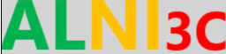{width="2.6in"} |

**SUIVI DES MODIFICATIONS MAJEURES**

| Indice | Date | Détails des modifications |
|:------:|:----:|:--------------------------|
| A | 01/11/2025 | Document initial |
| B | 31/03/2026 | Mise à jour |
| C | 12/09/2026 | Correction des erreurs formelles (orthographe, terminologie, attributions), remplacement de la liste des numéros utiles (référence erronée « MAKAAN OASIS »), structure de santé de proximité, ajout : gestion de la coactivité, permis espaces confinés, dispositions hivernage/chaleur |

\newpage

# Objectif, domaine d'application et responsabilités

## Objectif

Le présent **Plan Général de Coordination en matière de Sécurité et de Protection de la Santé (PGCSPS)** définit l'ensemble des mesures propres à prévenir les risques liés aux interventions **successives ou simultanées (coactivité)** des entreprises sur le projet KARIBU, en conformité avec la réglementation sénégalaise en vigueur. Il vise à garantir la sécurité et la protection de la santé des travailleurs tout au long du projet.

Le plan général de coordination SPS est établi dès la phase de conception du chantier. Il est tenu à jour et adapté en fonction de l'évolution de celui-ci.

## Domaine d'application

Le présent document s'applique à l'ensemble des travaux entrepris sur le chantier KARIBU et s'impose à toutes les entreprises intervenantes, titulaires ou sous-traitantes, ainsi qu'à tout intervenant sur le site (livraisons, contrôles, visites).

## Responsabilités

- **Le maître d'ouvrage** désigne le coordonnateur SPS et s'assure de l'exercice de la coordination pendant la phase de réalisation des travaux.
- **Le coordonnateur SPS** est responsable de la tenue à jour du présent document lors des différentes phases du projet, organise la concertation entre les intervenants et contrôle l'application des mesures de prévention.
- **Le chef de projet de l'entreprise générale** est garant du bon respect des prescriptions indiquées dans le présent document. L'ensemble des acteurs de chaque entreprise intervenante doit appliquer les présentes prescriptions.
- **Chaque entreprise intervenante** établit son PPSPS, transmet ses fiches de données de sécurité et ses documents d'habilitation, et fait procéder à l'accueil sécurité de son personnel.

# Abréviations et références

## Abréviations

| Abréviation | Description |
|:-----------:|:------------|
| CSPS | **Coordinateur Sécurité et Protection de la Santé** |
| EG | **Entreprise Générale** |
| EPC | **Équipement de Protection Collective** |
| EPI | **Équipement de Protection Individuelle** |
| FDS | **Fiche de Données de Sécurité** |
| HSE | **Hygiène, Sécurité, Environnement** |
| MOA | **Maîtrise d'Ouvrage** |
| MOE | **Maîtrise d'Œuvre** |
| PAS | **Point d'Accueil des Secours** |
| PGCSPS | **Plan Général de Coordination en matière de Sécurité et de Protection de la Santé** |
| PIC | **Plan d'Installation de Chantier** |
| PMR | **Personne à Mobilité Réduite** |
| PPSPS | **Plan Particulier de Sécurité et de Protection de la Santé** |
| QSE | **Qualité, Sécurité, Environnement** |
| RDC | **Rez-de-chaussée** |
| SST | **Sauveteur Secouriste du Travail** |
| TMS | **Troubles Musculo-Squelettiques** |
| VGP | **Vérification Générale Périodique** |
| dB | **Décibel** |

## Références

| Numéro | Titre | Référence |
|:------:|:------|:----------|
| **Normes, règlements, référentiels** |||
| 1 | Code du travail (Loi n° 97-17 du 1er décembre 1997) | Articles relatifs à l'hygiène, la sécurité et la durée du travail |
| 2 | Décret n° 94-1159 du 26 décembre 1994, modifié par le Décret n° 2003-68 du 24 janvier 2003 | Section 3 — Plan général de coordination en matière de sécurité et de protection de la santé |
| 3 | PPSPS des entreprises intervenantes | À joindre par chaque entreprise avant le démarrage de ses travaux |

# Renseignements

## Renseignements généraux

### Désignation de l'opération

**Présentation du projet**

Le projet KARIBU est un projet de construction d'un immeuble situé aux **Almadies** (commune de Ngor, Dakar — Sénégal).

Il sera construit sur un foncier de 1 000 m² comprenant :

- Deux niveaux de sous-sol avec cinquante-deux (52) places de parking ;
- Un RDC composé d'un hall, d'une piscine, d'une salle de sport, d'une salle polyvalente et de 2 appartements de type F2 ;
- Du 1^er^ au 6^e^ étage : six (6) appartements allant du F2 au F4 ;
- Au 7^e^ étage : cinq (5) appartements allant du F2 au F4 ;
- Au 8^e^ étage : trois (3) appartements, dont 2 F4 et 1 F6 ;
- À la terrasse : les installations techniques.

### Coordonnées des intervenants

#### Entreprise générale

- **NOM :** BOUSSO HOLDING
- **ADRESSE :** Mariste, Dakar
- **TÉLÉPHONE :** **[À RENSEIGNER]**
- **E-MAIL :** **[À RENSEIGNER]**

#### Maîtrise d'ouvrage

- **NOM :** Réalités Sénégal
- **ADRESSE :** Résidence SIKI, Almadies / Route de Ngor, Dakar 12000
- **TÉLÉPHONE :** **[À RENSEIGNER]**

#### Maître d'œuvre

- **NOM :** ALNI 3C
- **ADRESSE :** Diamalaye, Dakar
- **TÉLÉPHONE :** **[À RENSEIGNER]**

#### Bureau de contrôle

- **NOM :** APAVE
- **ADRESSE :** Cité Sipres, Fort B, Lot n°63 — BP 6334 Dakar
- **TÉLÉPHONE :** **[À RENSEIGNER]**

#### Coordinateur SPS

- **Titulaire :** Mme Ladara DIAGNE — Adresse : Nord Foire, Azur — **Tél. : +221 77 274 25 00**
- **Suppléant :** M. Ibrahima DIAMANKA — Adresse : Keur Massar — **Tél. : [À RENSEIGNER]**

### Description sommaire des travaux

Pour le projet KARIBU de construction d'un immeuble R+8 avec 2 sous-sols, la description sommaire des travaux est la suivante :

#### Études préliminaires

- **Étude de faisabilité** : analyse du terrain, étude des contraintes techniques, environnementales et réglementaires.
- **Étude géotechnique** : caractérisation du sol pour déterminer les fondations nécessaires.
- **Étude structurelle** : conception des structures porteuses du bâtiment (poutres, poteaux, dalles).
- **Permis de construire** : constitution du dossier, plans, conformité avec les réglementations locales.

#### Travaux de terrassement et fondations

- **Terrassement** : excavation du terrain pour préparer la construction des sous-sols et des fondations.
- **Fondations** : réalisation de fondations adaptées (fondations superficielles ou profondes, pieux) en fonction de l'étude géotechnique.
- **Drainage** : mise en place de systèmes de drainage pour éviter les infiltrations d'eau.

#### Construction des sous-sols

- **Étanchéité** : travaux d'étanchéité pour protéger les sous-sols contre les infiltrations d'eau.
- **Structure des sous-sols** : construction des murs de soutènement et des dalles.
- **Accès** : mise en place des rampes, escaliers et autres moyens d'accès aux sous-sols.

#### Superstructure (RDC + 8 étages)

- **Élévation des murs porteurs** : construction des murs de refend, des murs périphériques, des façades, des murs porteurs et des murs séparatifs extérieurs et intérieurs, selon les plans.
- **Dalles et planchers** : pose des dalles en béton à chaque étage.
- **Charpente et toiture** : mise en place de la charpente (traditionnelle ou métallique) et réalisation de la couverture.

#### Travaux de second œuvre

- **Cloisons et plafonds** : installation des cloisons intérieures et faux plafonds.
- **Revêtements** : pose des revêtements de sols (carrelage, parquet, etc.) et de murs (peinture, enduit).
- **Menuiseries** : installation des portes, fenêtres, garde-corps et autres éléments de menuiserie.

#### Installations techniques

- **Plomberie** : installation des réseaux d'alimentation en eau et des évacuations.
- **Électricité** : mise en place des réseaux électriques, luminaires, prises, tableaux électriques.
- **Ventilation et climatisation** : installation des systèmes de ventilation et climatisation.
- **Ascenseurs** : installation d'ascenseurs desservant les étages et les sous-sols.

#### Aménagement extérieur

- **Façades** : pose des finitions extérieures, bardage ou enduit selon le choix architectural.
- **Espaces verts** : aménagement des espaces verts ou autres éléments paysagers.
- **Accès et parking** : aménagement des voies d'accès et des parkings, incluant les zones piétonnes, les parkings souterrains et extérieurs.

#### Sécurité et conformité

- **Sécurité incendie** : installation des systèmes de détection incendie, extincteurs et voies d'évacuation.
- **Accessibilité PMR** : mise en conformité avec les normes applicables aux personnes à mobilité réduite.
- **Contrôles et certifications** : contrôle final des installations (électricité, gaz, etc.) et obtention des certificats de conformité.

#### Réception des travaux

- **Visite et validation des travaux** : vérification par étape et vérification finale par le maître d'ouvrage.
- **Levée des réserves** : correction des éventuels défauts constatés lors de la visite de réception.
- **Livraison** : remise officielle du bâtiment au maître d'ouvrage.

Chaque étape nécessite une planification minutieuse afin d'assurer le respect des délais, des coûts et des normes de sécurité.

### Liste des travaux sous-traités, noms et coordonnées des sous-traitants **[À RENSEIGNER]**

| Corps d'état / Lot | Nom de l'entreprise | Adresse | Type (T ou ST) | Effectif prévisionnel |
|:-------------------|:--------------------|:--------|:--------------:|:---------------------:|
| Gros œuvre | | | | |
| Électricité | | | | |
| Plomberie — CVC | | | | |
| Étanchéité | | | | |
| Menuiseries aluminium | | | | |
| Ascenseurs | | | | |
| Peinture / Finitions | | | | |
| Sécurité incendie | | | | |
| VRD / Aménagements extérieurs | | | | |

*Tableau 1 : Liste des sous-traitants — à compléter par l'entreprise générale dès l'attribution des lots.*

### Durée approximative des travaux

La durée approximative des travaux est de **24 mois**. **[Joindre le planning prévisionnel des travaux]**

### Effectif moyen prévisionnel **[À RENSEIGNER]**

| | Effectif moyen | Effectif de pointe |
|---|:---:|:---:|
| **Entreprise générale** | | |
| **Sous-traitants** | | |
| **Total** | | |

### Formation / habilitation du personnel intervenant

Le chef de projet de l'entreprise s'assure de l'effectivité de ces habilitations et les tient à disposition de tout organisme de contrôle.

Le personnel affecté au chantier dispose de toutes les formations et habilitations requises, conformément aux exigences applicables. Ces habilitations sont suivies par les services ressources humaines de chaque entité et reprises dans le registre du personnel du chantier.

| Fonction | Formation / Habilitation |
|---|---|
| Chauffeurs VL | Permis de conduire |
| Chauffeurs PL | Permis de conduire |
| Électricien | Habilitation électrique délivrée par l'employeur |
| Conducteurs engins TP | Autorisation de conduite délivrée par l'employeur |
| Conducteur de grue | Autorisation de conduite + aptitudes médicales |
| Échafaudeur / Monteur d'échafaudage | Formation montage/réception d'échafaudages |
| Sauveteur Secouriste du Travail | Certificat SST |
| Ensemble du personnel | Sensibilisation (accueil) sécurité chantier |

*Tableau 2 : Tableau de suivi des habilitations obligatoires*

### Encadrement travaux **[À RENSEIGNER]**

#### Chef de projet

Nom : **[À RENSEIGNER]** — Tél. : **[À RENSEIGNER]**

#### Conducteur de travaux

Nom : **[À RENSEIGNER]** — Tél. : **[À RENSEIGNER]**

#### Médecin du travail

Nom : **[À RENSEIGNER]** — Tél. : **[À RENSEIGNER]**

## Renseignements concernant les organismes de prévention

### Inspection du travail

- **Nom :** Mme Diatta
- **Fonction :** Agent d'administration
- **Tél. :** +221 77 534 75 40
- **Adresse :** 18, rue Ramez Bourgi, B.P. 21397 Dakar-Ponty, Dakar

### Structure de santé la plus proche

- **Nom :** Hôpital Militaire de Ouakam *(structure de référence la plus proche du site des Almadies)*
- **Adresse :** Ouakam, Dakar
- **Tél. :** +221 33 820 54 14

**Structure hospitalière de recours :**

- **Nom :** Centre Hospitalier National Universitaire de Fann
- **Adresse :** Avenue Cheikh Anta Diop, Dakar
- **Tél. :** +221 33 869 18 18

# Mesures d'organisation générale du chantier

## Accueil sécurité du personnel et formation

L'entreprise générale met en place un **accueil sécurité systématique** pour tout nouvel arrivant sur le chantier (personnel propre, sous-traitants, intérimaires, visiteurs). Chaque employeur demeure responsable de la présentation des consignes propres à ses postes de travail. Une traçabilité écrite de cet accueil (fiche signée) est conservée sur le chantier.

## Coordination SPS et suivi des mesures

**Rôles et responsabilités**

- Le coordinateur SPS effectue des visites régulières (au minimum hebdomadaires) pour vérifier la mise en place des mesures de sécurité et de protection.
- Un animateur HSE est présent en permanence sur le chantier pour veiller au respect des mesures de santé et de sécurité.
- Un rapport hebdomadaire, ainsi qu'un rapport d'incident le cas échéant, est rédigé et partagé avec le maître d'œuvre et les autres intervenants du projet.
- Le coordinateur SPS ou son suppléant contrôle la mise en œuvre des mesures de prévention définies dans le PPSPS de chaque entreprise exécutante.
- L'animateur SPS/HSE suit les conditions de coactivité entre les entreprises.
- Toute non-conformité constatée fait l'objet d'une **fiche de non-conformité** (Annexe 5) avec délai de traitement et vérification de l'efficacité.
- En cas de **danger grave et imminent**, le coordinateur SPS demande l'arrêt des travaux concernés ; la reprise n'intervient qu'après vérification de la mise en conformité.

**Gestion de la coactivité**

- Lorsque plusieurs entreprises interviennent simultanément dans une même zone, un **plan de prévention des risques liés à la coactivité** est établi avant le démarrage des travaux concernés : partage des zones, planification séquencée, protections contre les chutes d'objets entre niveaux, gestion des levages simultanés.
- Toute nouvelle entreprise intervenante transmet son PPSPS au coordinateur SPS **avant** son entrée sur chantier.

**Réunions de sécurité**

- Des réunions hebdomadaires de sécurité sont organisées avec les équipes.
- Des sensibilisations hebdomadaires (« quart d'heure sécurité ») sont également organisées ; thèmes abordés : rappel des consignes de sécurité, identification de nouveaux risques, état des dispositifs de prévention, port des EPI.
- Un **comité de coordination SPS** se réunit mensuellement avec le maître d'œuvre, l'entreprise générale et les représentants des sous-traitants présents.

## Mesures de sécurité obligatoires

| Thème | Points à observer | Observations |
|---|---|---|
| **EPI** | Casques, gilets, gants, chaussures, harnais (travaux en hauteur) | Vérification quotidienne |
| **Accès chantier** | Portail sécurisé, badgeage, signalisation claire | Contrôle à l'entrée |
| **Protection contre les chutes** | Garde-corps, filets, lignes de vie | Vérification des fixations à chaque utilisation des dispositifs de travail en hauteur |
| **Échafaudages** | Conformes au plan, vérification au montage et hebdomadaire | Attestation de montage |
| **Circulation interne et externe** | Cheminements matérialisés, dégagement des zones de circulation | Vérification quotidienne |
| **Électricité chantier** | Coffrets protégés, câbles gainés | Vérification quotidienne |
| **Propreté / rangement** | Vérification des espaces de travail | Suivi quotidien par le chef d'équipe |
| **Coactivité** | Plans de prévention, planification séquencée | Contrôle par le coordinateur SPS |
| **Secours / premiers soins** | Trousses et extincteurs disponibles et vérifiés | Contrôle mensuel |

*Tableau 3 : Vérifications obligatoires des mesures de sécurité*

## Horaires de travail du chantier

Les horaires de travail sont communiqués par note de service. Ils sont de **8 h à 17 h**, avec une pause de 13 h à 14 h. Conformément à l'article L.135 du Code du travail [N.1], la durée normale du travail est de **40 heures par semaine**. Les travaux de nuit ne sont pas exclus, dans les conditions prévues par l'article L.140 du Code du travail sénégalais.

## Circulation

Se référer au plan de circulation de chantier : **[insérer la codification du plan de circulation de chantier]**.

Toute personne pénétrant sur le chantier est tenue de porter en toutes circonstances un gilet haute visibilité, des chaussures de sécurité et un casque de chantier.

### Circulation horizontale

Pendant toute la durée du chantier, l'entreprise reste seule responsable des accidents et dégâts de diverses natures qui pourraient résulter d'un défaut d'entretien, de dégradations ou de pollutions apportées par la circulation de ses engins et camions sur la chaussée ou sur l'emprise de la zone de travaux.

Tous les obstacles, tels que les lignes électriques aériennes et les câbles téléphoniques, devront être déplacés avant le démarrage des travaux.

Les mesures spécifiques à prendre en compte pour la circulation de chantier sont :

- Le code de la route est toujours applicable ;
- Les usagers de la voie publique sont toujours prioritaires, en particulier à l'accès principal du chantier lors de la sortie des véhicules ;
- Les engins de production ont priorité sur les autres véhicules ;
- Freinages et accélérations brutales proscrits ;
- Les manœuvres doivent être limitées et se faire en toute sécurité : pas de personnel travaillant sur un poste différent dans le rayon d'action de l'engin manœuvrant ;
- Les engins doivent être équipés d'un avertisseur sonore de recul (« bip de recul ») ;
- Le stationnement ne se fait pas derrière un engin de chantier ;
- Toute personne évoluant à l'intérieur du chantier, y compris les conducteurs d'engins, doit porter les Équipements de Protection Individuelle « EPI » (gilet rétro-réfléchissant de classe II, casque, chaussures de sécurité) ;
- La vitesse des véhicules doit, en permanence, être adaptée aux conditions de circulation ;
- Tous les véhicules circulent feux de croisement allumés ;
- L'utilisation des téléphones portables est interdite dans les zones d'opérations et au volant.

### Cheminement piétons

Tous les travailleurs et visiteurs doivent être formés aux règles de sécurité relatives aux cheminements piétons dès leur arrivée sur le chantier.

Il est interdit de porter des écouteurs dans les zones d'opérations.

### Stationnement des véhicules

Le stationnement des véhicules devra se faire sur les emplacements prévus à cet effet. Les véhicules de chantier ne doivent en aucun cas stationner sur les emprises de travaux ou à proximité des engins. Sur les zones dédiées, le stationnement en marche arrière est requis. Une zone de stationnement sera définie. Les accès doivent être dégagés pour faciliter l'intervention des secours.

### Plan d'installation de chantier **[À INSÉRER]**

### Panneau de chantier

L'entreprise installera à l'entrée du chantier un panneau interdisant l'accès à toute personne étrangère au chantier et rappelant le port obligatoire des EPI et le respect des mesures spécifiques. Les **numéros d'urgence** (Annexe 3) y figurent.

Un panneau de point de rassemblement est également installé dans une zone prévue à cet effet.

# Base travaux

- Magasin : oui ;
- Sanitaires / vestiaires : oui ;
- Bureau de chantier : oui ;
- Réfectoire / espace repas : **[À CONFIRMER]**.

L'approvisionnement en eau du chantier (eau potable et eau de travaux) est de la responsabilité de l'entreprise générale. Une cuve sera mise en place au chantier si nécessaire pour les besoins en eau non potable.

La gestion des déchets (tri, bennes, évacuation régulière vers une filière autorisée) relève de l'entreprise générale ; chaque entreprise est responsable de l'enlèvement de ses déchets spécifiques (produits chimiques, huiles).

# Travaux — Risques — Protection

## Désignation des principales opérations d'exécution et prévention des risques

| Activité | Équipements principaux | Risques | Pictogrammes de danger | Mesures de prévention et équipements de protection |
|---|---|---|---|---|
| Réalisation de l'implantation topographique | Équipement topographique (station totale, GPS et accessoires) ; personnel à pied | Heurt par engins, chute de plain-pied | 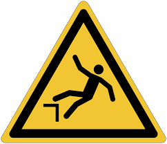{width="0.6in"} 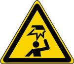{width="0.6in"} | Respect des consignes de circulation du chantier (piétonne, routière) ; port des EPI adaptés |
| Réalisation de l'arse de terrassement, de la couche de forme et de la couche de base | Camion semi-benne, chargeur, compacteur, engins, personnel à pied | Effondrement des tranchées ; chute de plain-pied ; chute dans les fouilles ; collision avec les engins | {width="0.6in"} 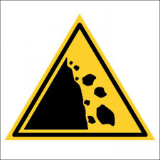{width="0.6in"} 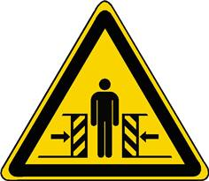{width="0.6in"} | Respect des consignes de circulation ; formation et habilitation du personnel ; engins conformes à la législation en vigueur, avertisseur de recul ; suivi et entretien des engins ; signalisation et clôture des zones à risque (rubans de chantier, garde-corps) ; stabilisation des parois / système de blindage ; port des EPI ; mise en place des EPC adaptés |
| Fondations et sous-sols | Camions toupie, pompe à béton, personnel à pied, engins | Inhalation de poussières ; risque d'éboulement ; risque d'effondrement | 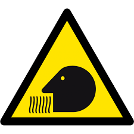{width="0.6in"} {width="0.6in"} {width="0.6in"} {width="0.6in"} | Respect des consignes de circulation ; formation et habilitation du personnel ; engins conformes, avertisseur de recul ; suivi et entretien ; port des EPI ; mise en place des EPC ; respect des consignes de travaux en fouilles ; arrosage des zones pour réduire les poussières ; étude et protection de la mitoyenneté ; protection des fouilles |
| Travaux de levage et élévation de la structure ; activités de la grue | Personnel à pied, engins de levage | Chute de hauteur ; chute d'objets ; heurt par charges | 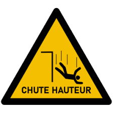{width="0.6in"} 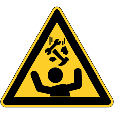{width="0.6in"} 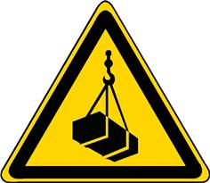{width="0.6in"} {width="0.6in"} | Formation et habilitation du personnel ; suivi et entretien des engins ; utilisation d'échafaudages sécurisés ; lignes de vie ; filets antichute ; zone interdite en dessous ; respect des périmètres de sécurité dans les zones d'évolution des engins ; coordination des manutentions mécaniques ; étude et protection de la mitoyenneté ; contrôle du matériel et des engins avant chaque utilisation ; fiche technique de la grue ; sensibilisation spécifique grue |
| Pose des dalles et planchers | Engins de levage, personnel | Effondrement partiel | {width="0.6in"} | Vérification par ingénieur ; signalisation ; contrôle structurel régulier des coffrages et armatures ; port des EPI adaptés ; formation et habilitation du personnel |
| Cloisonnement intérieur | Outillage tranchant et pointu | Manutention manuelle et troubles musculosquelettiques ; coupures | 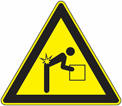{width="0.6in"} 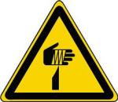{width="0.6in"} | Formation gestes et postures ; port des EPI ; suivi et entretien de l'outillage ; utilisation d'outils mécanisés |
| Travaux en électricité | Plateforme de travail | Électrocution, électrisation, brûlures | 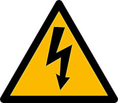{width="0.6in"} 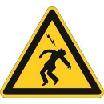{width="0.6in"} | Coupure du courant pendant les interventions ; gants isolants et équipements de protection ; formation aux risques électriques ; permis de travail électrique + consignation |
| Plomberie | Produits nocifs | Risque d'inhalation de produits nocifs | {width="0.6in"} 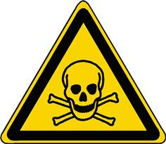{width="0.6in"} | Utilisation des protections respiratoires ; bonne aération et ventilation des espaces ; port des EPI adaptés ; FDS disponibles |
| Peinture et finitions (menuiserie, carrelage…) | Produits nocifs | Risque d'inhalation de produits nocifs ; blessures | {width="0.6in"} {width="0.6in"} | Utilisation de produits moins nocifs ; aération permanente ; port des EPI adéquats |
| Interventions en espaces confinés (sous-sols, cuves, regards) | Détecteur de gaz, ventilation, harnais | Asphyxie ; intoxication ; chute | {width="0.6in"} 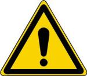{width="0.6in"} | Permis de travail dédié ; détection des gaz avant et pendant l'intervention ; ventilation forcée ; surveillant à l'extérieur ; moyens de communication |
| Sécurité incendie | Manipulation de produits inflammables | Incendie ou explosion | 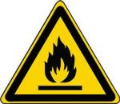{width="0.6in"} | Formation incendie ; stockage sécurisé des matériaux inflammables ; extincteurs et alarmes incendie ; permis feu pour les points chauds |
| Gestion des déchets | Manipulation d'objets tranchants | Risques de coupures | {width="0.6in"} | Tri des déchets ; élimination régulière des matériaux coupants ; port des EPI |

*Tableau 4 : Désignation des principales opérations d'exécution et traitement des risques*

Chaque employé doit être équipé d'équipements de protection individuelle (EPI) adaptés : casque, gants, chaussures de sécurité, harnais, masques, etc.

Les mesures doivent évoluer en fonction de l'avancement du chantier et des nouveaux risques identifiés (notamment pendant la période d'hivernage : ruissellement, boue, renforcement des protections de fouilles et des accès).

## Consignes générales de sécurité

### Bruit

- À partir de **80 dB(A)** : si une protection collective ne peut pas être mise en place, des protections individuelles sont mises à disposition des salariés.
- À partir de **85 dB(A)** : un programme en vue de réduire le bruit est établi. Dans l'attente ou dans l'impossibilité de réduire le bruit, le port des protections individuelles est obligatoire.

### Travaux en hauteur

Les travaux en hauteur font l'objet d'une analyse particulière pour prévenir les risques de chute. La protection collective (garde-corps, filets, échafaudages conformes) est prioritaire. Si la mise en place de garde-corps n'est pas possible, le personnel est équipé de harnais antichute relié à un point d'ancrage ou à une ligne de vie. Le personnel concerné est formé à l'utilisation de ces équipements. Les travaux en hauteur sont suspendus en cas de pluie ou de vent fort.

### Chaleur et hydratation

Compte tenu des conditions climatiques de Dakar, les mesures suivantes s'appliquent : eau potable fraîche en libre service, aménagement des horaires pendant les pics de chaleur, pauses renforcées, surveillance des signes de coup de chaleur par les SST.

### Stockage de produits chimiques

**Carburant**

Le remplissage journalier de chaque engin se fera à l'aide d'un camion de ravitaillement. Les pleins se feront par la méthode dite du « bord à bord ». Toutefois, compte tenu des lieux d'exécution des travaux, le stockage de carburant sur le chantier (bidons) pourra être envisagé. Ces bidons seront entreposés sur des bacs de rétention et balisés conformément à la législation en vigueur.

Les mesures de prévention correspondant à l'utilisation et au stockage des produits chimiques seront mises en place. **Les fiches de données de sécurité (FDS) de chaque produit sont tenues à disposition sur le chantier.**

**Lubrifiants**

Huiles et graisses ne seront pas stockées sur le chantier. Le ravitaillement se fera par camion de graissage équipé au besoin.

## Équipements de protection individuelle (EPI)

### Conformité

Les EPI sont conformes aux normes en vigueur, selon le type.

### Contrôle des EPI

Les EPI mis à disposition sont adaptés au travailleur et aux activités réalisées.

L'utilisation effective des EPI est contrôlée et la non-utilisation des EPI est sanctionnée selon la procédure de non-conformité (Annexe 5).

Certains EPI doivent être contrôlés périodiquement selon les prescriptions du fabricant, afin de garantir leur pleine fonctionnalité.

### Protections individuelles minimales obligatoires

Les EPI minimaux obligatoires :

- Casque de protection ;
- Vêtement de signalisation haute visibilité de classe II ;
- Chaussures de sécurité mi-hautes (les chaussures basses sont interdites).

Les EPI à prévoir selon l'activité :

- Gants adaptés ;
- Lunettes et autres protections des yeux ;
- Protections auditives ;
- Masques filtrants de protection ;
- Harnais de sécurité.

## Équipements, engins

### Généralités

La conformité des équipements et engins est démontrée par une **vérification générale périodique (VGP)** avec la périodicité suivante :

- Tous les **6 mois** pour les engins et équipements de levage ;
- Tous les **12 mois** pour les autres engins et équipements.

### Conduite d'engins

Un engin n'est utilisé que dans un endroit bien ventilé, dans un espace d'évolution adapté et suffisant. Concernant les engins de levage ou à godet, la charge ne doit jamais passer au-dessus du personnel ou de l'habitacle d'un véhicule.

Le conducteur doit garder la cabine de sa machine dans un état de propreté convenable. Le plancher, les rétroviseurs et les surfaces vitrées seront minutieusement entretenus. Tout objet étranger à la conduite ne doit pas se trouver dans la cabine. Le conducteur (pelle, chargeur, benne) devra en permanence être attentif aux obstacles situés en hauteur (ponts, fils électriques, câbles, branches, …) et respecter en particulier un périmètre de sécurité autour des câbles électrifiés.

Préalablement à la mise en route, le conducteur doit effectuer un contrôle visuel de sa machine pour vérifier l'absence de personnel à proximité et s'assurer de son bon état général.

L'accès (montée et descente) à la machine se fait toujours face à la machine, à l'aide du marchepied et selon la règle des trois appuis (2 pieds + 1 main ; 1 pied + 2 mains). En démarrant l'engin, le conducteur vérifie les niveaux et témoins (pression d'huile, température, système d'asservissement, …). Il doit également s'assurer du fonctionnement des feux de recul et du klaxon.

Les règles de circulation qui s'appliquent sont celles du plan de circulation du chantier, ou à défaut celles du code de la route :

- Le conducteur doit toujours avoir en sa possession l'autorisation de conduite délivrée par son employeur ;
- Le conducteur doit toujours boucler sa ceinture ;
- L'utilisation du téléphone portable est interdite ;
- La circulation se fait sur les pistes de chantier à une vitesse raisonnable et contrôlée ;
- Respect de la signalisation du chantier ;
- Respect des distances de sécurité par rapport aux autres engins pour assurer un freinage dans de bonnes conditions ;
- Utilisation des feux en cas de brouillard ou de poussière ;
- Éviter de rouler sur les accotements et les bords de talus, souvent instables ;
- Toujours donner la priorité aux engins en charge.

## Moyens matériels

### Électricité

Les installations électriques des bureaux, ainsi que celles des engins de chantier, sont conformes à la législation en vigueur. Ces installations sont vérifiées avant mise en service.

### Eau

L'entreprise générale met à disposition une quantité d'eau potable suffisante : **3 L/jour/personne**.

### Éclairage / Signalisation

Selon la configuration des lieux, la liste des équipements prévus est :

| Équipement | Matériel |
|---|---|
| Éclairage collectif | Mât d'éclairage |
| Éclairage portatif individuel | Lampe frontale |
| Autre(s) | **[À RENSEIGNER]** |

### Matériel de chantier

Le petit matériel (portatif ou semi-portatif) est vérifié visuellement avant chaque utilisation. Ce matériel comporte une notice d'utilisation en français et, le cas échéant, un certificat de vérification à la livraison de la machine.

Les échelles, comme les escabeaux ou les marchepieds, ne sont pas des postes de travail. Ils sont positionnés de telle façon que leurs marches soient horizontales. Les échelles seront fixées en tête ou en pied, ou par tout autre dispositif les empêchant de glisser. De plus, elles dépasseront d'un mètre le niveau d'accès supérieur. Les échelles composées de plusieurs éléments disposeront d'un moyen de blocage des différents éléments entre eux.

## Fréquence des permis de travail

| Type de permis | Fréquence (par jour) | Fréquence (durée des travaux) | Commentaires | Délai d'obtention avant travaux | Précision |
|---|:---:|:---:|---|---|---|
| Travaux à chaud (permis feu) | X | | Pour chaque opérateur | Avant début des travaux | |
| Fouilles | | X | Pour l'ensemble des opérateurs | 10 jours avant travaux | Tout chantier ayant une emprise sur le domaine public |
| Travaux en hauteur | X | | Pour chaque opérateur | Avant début des travaux | |
| Travaux électriques | X | | Pour chaque opérateur | Avant début des travaux | En plus du permis : déclaration à la SENELEC + consignation lors des travaux |
| Espaces confinés | X | | Pour chaque intervention | Avant début des travaux | Sous-sols, cuves, regards ; détection gaz + surveillant |
| Conduite d'engin | | X | Pour chaque opérateur | Avant début des travaux | Sauf mission spéciale |
| Manipulation de produits dangereux | X | | Pour chaque opérateur | Avant début des travaux | |
| Transport de charges | | X | Pour l'ensemble des opérateurs | Avant début des travaux | |
| Manutention et levage | X | | Pour chaque opérateur | Avant début des travaux | |

*Tableau 5 : Fréquence des permis de travail — le modèle de permis figure en Annexe 1.*

# Organisation des secours

## Consignes sur la conduite à tenir en cas d'accident

Les consignes particulières sur la conduite à tenir en cas d'incident et d'accident sont :

1. Protéger la victime ;
2. Alerter le secouriste et porter secours au blessé ;
3. Alerter les secours au **18** (Sapeurs-Pompiers) ou au **15 15** (SAMU).

Les consignes particulières sur la conduite à tenir en cas d'incendie sont :

1. Déclencher l'alarme (si existante) ;
2. Alerter les secours (**18 — POMPIERS**) ;
3. S'attaquer à la base des flammes avec l'extincteur ;
4. Suivre les indications du guide-file lors de l'évacuation ;
5. Rejoindre le point de rassemblement.

Dans tous les cas, appeler le numéro du Coordinateur SPS : **+221 77 274 25 00**.

Des extincteurs appropriés selon le risque inhérent (poudre et CO₂) seront mis en place au niveau des installations de chantier. Leur contrôle est effectué annuellement par un organisme certifié extérieur. L'emplacement des équipements de lutte contre les incendies est matérialisé par un pictogramme, et une sensibilisation est faite à tout le personnel de chantier lors des quarts d'heure QSE.

Pour tout accident et incident, un rapport est établi et transmis aux parties prenantes sous **48 h maximum**, et une analyse est menée pour éviter toute récidive.

## Nombre de secouristes sur le chantier et moyen de reconnaissance

L'entreprise dispose de salariés Sauveteurs Secouristes du Travail formés ou recyclés (1 pour 20 travailleurs, ou 1 par équipe sur une même zone de travail, pendant toute la durée des travaux).

Les salariés sauveteurs secouristes seront identifiés sur le chantier par un autocollant « secouriste » sur le casque.

En cas de blessé grave, la victime sera conduite rapidement à la structure de santé la plus proche (Hôpital Militaire de Ouakam — voir §3.2.2).

## Matériel médical existant sur le chantier

Une trousse de pharmacie complète sera disponible sur le chantier. Son contenu est établi en collaboration avec le médecin du travail et tenu à jour avec des produits non périmés, en fonction des risques auxquels sont exposés les salariés.

Contenu de la trousse de pharmacie :

**Matériel**

- Ciseaux à bouts ronds (14 cm) + pince à échardes ;
- 10 gants à usage unique en vinyle (sous conditionnement individuel) ;
- Sachets plastiques en rouleau (type sachet congélation) ;
- 2 écharpes triangulaires en toile ;
- 1 masque de protection pour bouche-à-bouche ;
- 1 sac pour récupération des déchets.

**Antiseptiques**

- Alcool à 70° pour désinfection des mains et du matériel ;
- Flacon de bétadine.

**Pansements**

- Compresses stériles non tissées grand et moyen format (0,30 × 0,30 — 0,20 × 0,20) sous conditionnement individuel ;
- Pansements auto-adhésifs (hypoallergéniques sans latex) non tissés prédécoupés de plusieurs tailles sous conditionnement individuel ;
- Bandes cohésives type Coheban™ 3 m × 0,07 m et 3 m × 0,10 m ;
- Filet de maille extensible type Surgifix™ doigt et membre ;
- Sparadrap tissé, hypoallergénique, déchirable, largeur 0,02 m ;
- Pansement compressif type CHUT (Coussin Hémostatique d'Urgence Thuasne) en latex + bande élastique de contention.

**Autres produits**

- Sérum physiologique (en sachets unidoses) ;
- Dacryosérum™ 150 ml (solution de lavage oculaire) ;
- Compresses stériles de tulle grasse de type Jelonet™ ;
- Sucre en morceaux dans une petite boîte hermétique étiquetée ;
- Bouteille d'oxygène.

Seuls les salariés Sauveteurs Secouristes du Travail formés sont habilités à utiliser le contenu de la trousse de pharmacie pour dispenser les premiers soins.

# Annexes

Nota : les annexes peuvent être intégrées au document ou jointes en tant que fichiers.

| N° | Titre de l'annexe |
|:---:|---|
| 1 | Modèle de permis de travail |
| 2 | Fiche de remise des EPI |
| 3 | Liste des numéros utiles — KARIBU |
| 4 | Liste des Sauveteurs Secouristes du Travail et sécurité incendie |
| 5 | Fiche de non-conformité |

## Annexe 1 — Permis de travail

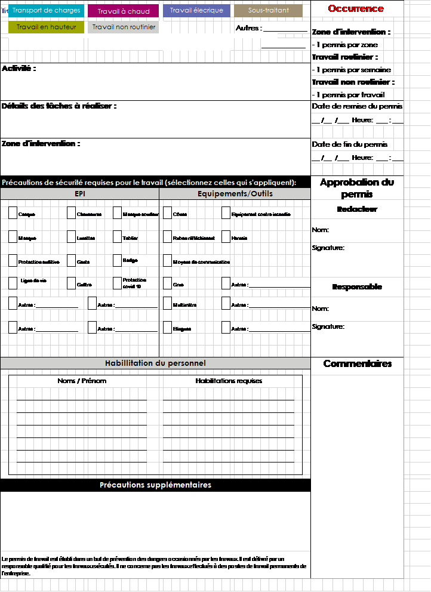{width="5.9in"}

## Annexe 2 — Fiche de remise des EPI

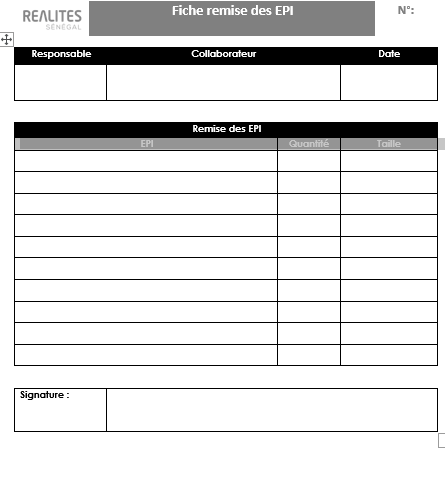{width="4.6in"}

## Annexe 3 — Liste des numéros utiles — KARIBU

| Organisme / Fonction | Numéro |
|---|---|
| **Coordinateur SPS (Mme L. DIAGNE)** | +221 77 274 25 00 |
| Service Sécurité-Hygiène-Environnement | 78 136 41 08 — 77 274 25 00 |
| Chef de projet | **[À RENSEIGNER]** |
| Conducteur de travaux | **[À RENSEIGNER]** |
| Police | 17 |
| Sapeurs-Pompiers | 18 |
| Gendarmerie Nationale | 800 00 20 20 |
| SAMU | 15 15 |
| SOS Médecins | 33 889 15 15 |
| Centre National Antipoison | 33 825 40 07 |
| Hôpital Militaire de Ouakam | 33 820 54 14 |
| Hôpital Philippe Maguilene Senghor | 33 820 12 28 |
| CHNU de Fann | 33 869 18 18 |
| Centre de Gestion des Urgences Environnementales | 12 21 |
| Inspection du travail (Mme Diatta) | +221 77 534 75 40 |

## Annexe 4 — Liste des Sauveteurs Secouristes du Travail et sécurité incendie **[À RENSEIGNER]**

| Prénom et Nom | Entreprise | Fonction | Numéro de téléphone |
|---|---|---|---|
| | | | |
| | | | |
| | | | |

## Annexe 5 — Fiche de non-conformité

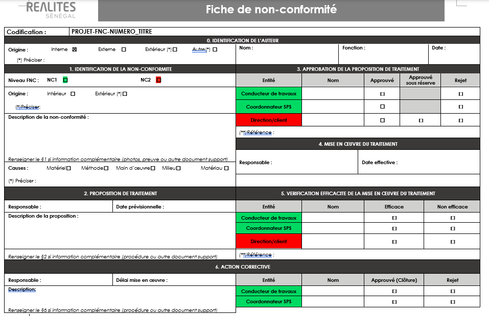{width="6.5in"}
